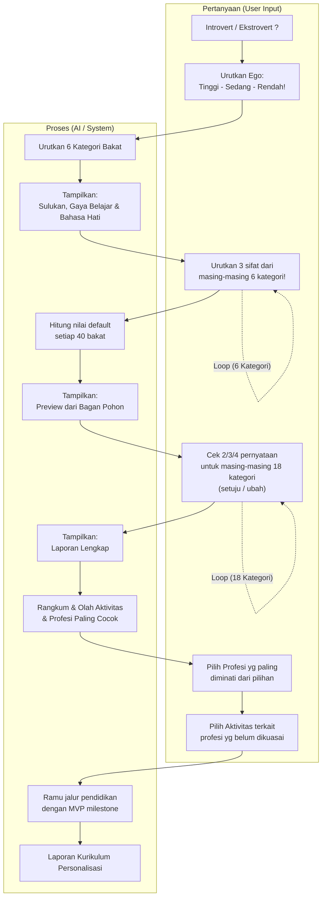

# Workflow Diagram

Below is the Mermaid representation of your workflow diagram, divided into Pertanyaan (User Inputs/Questions) and Proses (System Processing/Outputs).

## Workflow Summary

- **Personality & Ego Intake**: User specifies Introvert/Ekstrovert and ranks Ego level.
- **Talent Category Ranking**: System ranks 6 talent categories and outputs learning style & preferences (Sulukan, Gaya Belajar & Bahasa Hati).
- **Trait Ranking & Scoring**: User ranks 3 traits across 6 categories (iterative loop), triggering calculation for 40 talent default values and displaying a tree chart preview (Bagan Pohon).
- **Statement Verification**: User verifies statements across 18 categories (iterative loop), producing the complete report (Laporan Lengkap).
- **Career & Activity Matching**: System summarizes best-fit activities/professions. User selects preferred professions and unmastered skills.
- **Curriculum Generation**: System creates an MVP milestone educational path resulting in a Personalized Curriculum Report (Laporan Kurikulum Personalisasi).