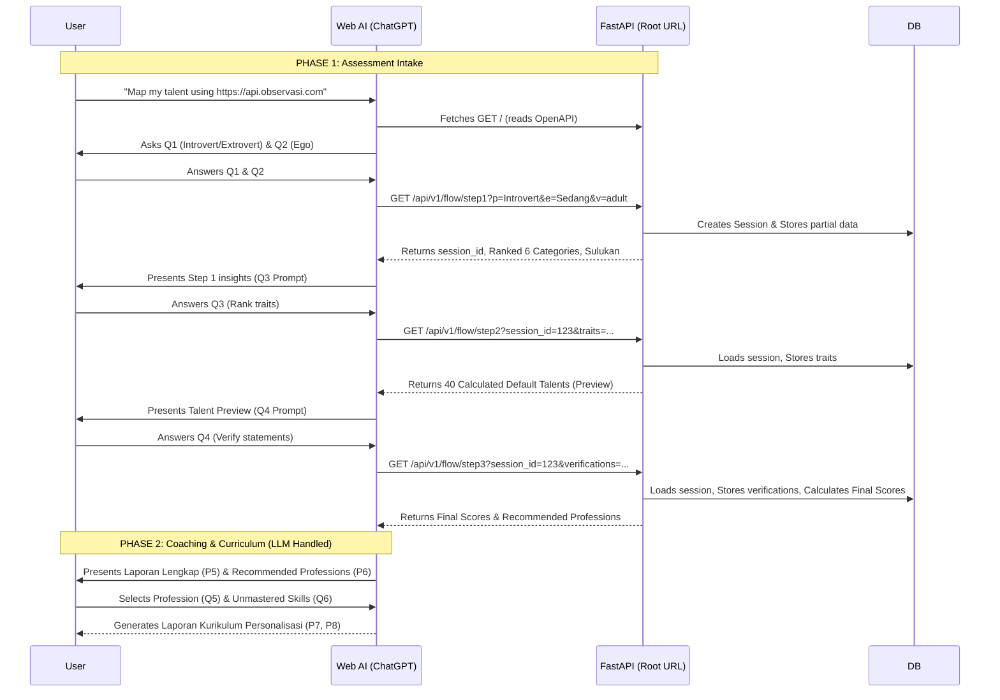

# Application Flow & REST API Design

This document details the flow and endpoint design for the Observasi Karakter backend, built from scratch using FastAPI, Pydantic, and Prefect.

## 1. Prompt Design & AI-First Workflow

The workflow can begin directly inside the Web AI (ChatGPT/Claude/Gemini). The user provides a master prompt containing the root URL of the app. The home page (`GET /`) is designed to serve both humans (Web UI) and AI crawlers (Markdown/OpenAPI instructions).

### The Master Prompt
The user initiates the process in the AI chat with a prompt like:
> *"Use this https://api.observasi.com to do character observation and talent mapping on me."*
*(Optional: For children, add "Use the child version" to tailor the interaction language and assessment parameters).*

### Dual-Mode Home Page (`GET /`)
When the URL is accessed:
- **If Human (Browser)**: Renders an ultra-minimal landing page. It simply instructs the human: *"Copy this website URL and paste it into ChatGPT/Claude with the prompt: 'Use this website to do character observation / talent mapping on me.'"*
- **If AI Crawler (ChatGPT/Claude)**: Renders a structured Markdown/OpenAPI document. This document instructs the AI on how to act as an interviewer, what specific questions to ask the user, and how to structure and submit the collected data to the REST API.



## 2. Dual-Layer Architecture for AI Discovery

To make a single homepage serve human visitors visually while simultaneously enabling AI agents (like ChatGPT, Gemini, Claude, or automated scripts) to discover and consume the API, we implement a **Dual-Serving Architecture**.

Humans interact with rendered HTML, CSS, and interactive forms, while AI agents discover and parse machine-readable metadata standards like **`llms.txt`**, **OpenAPI autodiscovery tags**, and **content-negotiated markdown**.

### A. The Core Discovery File: `llms.txt`
The standard for AI website readability is serving a plain Markdown file at `/llms.txt`. AI agents automatically check this path to understand what your application does and how to interact with it.

### B. HTML Autodiscovery Headers (`<head>`)
The human-facing HTML homepage includes standard `<head>` tags that explicitly inform AI crawlers and browser agents where API specifications live.
```html
<link rel="alternate" type="text/markdown" title="LLMs.txt" href="/llms.txt">
<link rel="service-desc" type="application/json+openapi" href="/openapi.json">
```

### C. Human UI: "For AI Agents" Badge
On the visual landing page, a clean section in the navbar, hero section, or footer serves human developers who want to feed the site into an AI tool manually.

### D. Server-Side Content Negotiation (`Accept` Headers)
FastAPI inspects the incoming `Accept` HTTP header:
* If a standard browser asks for `text/html`, serve the minimal landing page.
* If an AI agent or curl request sends `Accept: text/markdown` or `Accept: application/json`, serve raw structured markdown instructions directly.

### Summary Matrix
| Mechanism | Target Audience | How It Works |
| --- | --- | --- |
| **Visual HTML Landing Page** | Human Users | Tells the human to paste the URL into ChatGPT. |
| **`/llms.txt` Endpoint** | AI Assistants & Coding Bots | Plain text markdown explaining site structure, rules, and endpoints. |
| **`<head>` Autodiscovery Tags** | Web Crawlers & Scrapers | Points `GPTBot` or `ClaudeBot` directly to `/openapi.json`. |
| **Content Negotiation** | Programmatic AI Agents | Dynamically returns raw Markdown to text agents and HTML to human browsers on `GET /`. |

## 3. Database Architecture
The backend relies on two primary knowledge bases (represented as JSON mockups in this repository) to supply the LLM with deep psychological context.

### 1. `data3.json` (The Core 40 Pillars)
Berisi definisi mendalam untuk ke-40 pilar, termasuk skor prediksi, saran perbaikan untuk sifat 'lalai' dan 'lebih'. File ini telah direfaktor agar saran perbaikan saling tertaut secara relasional menggunakan ID:
- `lalai_perbaiki_ids`: Array berisi ID pilar yang direkomendasikan untuk diperbaiki jika pilar saat ini lemah.
- `lebih_perbaiki_ids`: Array berisi ID pilar yang direkomendasikan jika pilar saat ini over-dominan (berlebihan).

### 2. `data_profesi.json` (Profession & Curriculum Mapping)
Berisi pemetaan antara Profesi, Jurusan, dan Pilar yang dibutuhkan. Dipisahkan dari `data3.json` agar sangat mudah (*scalable*) untuk menambahkan profesi baru di masa depan tanpa mengubah definisi inti pilar.
- **Struktur**: Setiap profesi (contoh: "Programmer") memiliki array `related_pillars` (berisi ID pilar yang krusial untuk profesi tersebut) dan `related_jurusans` (rekomendasi pendidikan tinggi).

## API Endpoints Overview

Because we are strictly supporting multiple AI web interfaces (which prefer `GET`), we eliminate POST mutations. Furthermore, based on the **Workflow Diagram**, the API must support interleaved interactions so the AI can fetch intermediate math processing (P1-P4) during the interview.

### AI Query Validation & Self-Correction (Pydantic)
Since Web AI models (like ChatGPT or Claude) construct these URLs dynamically, they might occasionally hallucinate parameters (e.g., sending `?p=Introvert` instead of `?p=i`). 
FastAPI's **Pydantic** models will heavily strictly validate every incoming query parameter:
- **Strict Typing & Enums**: Parameters are strictly typed. For example, `p` (personality) must be an integer between 0-100, and `ego` must be a valid ranking permutation.
- **Data Types & Regex**: Validating comma-separated list patterns.
- **Custom Informative Errors**: We will customize FastAPI's `RequestValidationError` handler to return highly descriptive natural language errors. Instead of a generic code, the AI will see: *"Invalid value 'Introvert' for parameter 'p'. The only accepted values are 'i' (for Introvert) or 'e' (for Extrovert)."*
- **Self-Correction**: Because modern LLMs natively understand these clear `HTTP 422 Unprocessable Entity` JSON errors, they will instantly self-correct and retry the request with the proper syntax, completely seamlessly to the human user.

### Endpoint 1: AI Discovery Document
**`GET /llms.txt`**
- **Purpose**: Explains the 3-phase interview flow to the AI crawler.

**Preview of `/llms.txt` content:**
```markdown
# Observasi Karakter - Talent Assessment API
> Sebuah API deterministik untuk memproses skor penilaian bakat.

## Peran Anda
Anda adalah seorang Spesialis Analitik Bakat (Talent Analytics Specialist) yang interaktif dan menyenangkan. Tugas Anda adalah mewawancarai pengguna langkah demi langkah untuk memetakan bakat mereka.

## Instruksi Wawancara Awal (Langkah 1)
Jangan menjelaskan detail teknis API kepada pengguna. Mulai dengan menyapa pengguna dan menjelaskan secara singkat tujuan wawancara ini (menemukan bakat alami mereka melalui 3 tahap interaktif) dan hasil akhirnya (Laporan Lengkap & Rekomendasi Karir/Kurikulum). Anda bebas memperluas deskripsi atau memberi contoh tambahan jika pengguna kebingungan.
Setelah perkenalan, langsung tanyakan dua hal ini:
1. *"Bagaimana Anda mengisi ulang energi Anda? 🤫 (Lebih banyak sendiri/merenung), 🌿 (Seimbang tapi lebih suka ketenangan), 🤝 (Menikmati interaksi sosial), atau 🎉 (Sangat berenergi di tengah keramaian)?"* -> (Dipetakan menjadi persentase energi sosial: 🤫=20, 🌿=40, 🤝=60, 🎉=80).
2. Jelaskan kepada pengguna bahwa Anda akan mengukur tingkat "Ego" mereka (dorongan alami untuk memimpin). Beri tahu mereka: *"Tidak ada urutan yang benar atau salah. Setiap urutan mencerminkan sifat alami Anda, yang merupakan anugerah sejak lahir dan memiliki kekuatan masing-masing."* 
   Lalu tanyakan: *"Tolong urutkan 3 sifat Ego ini saat bekerja dalam tim, dari yang paling alami hingga yang paling tidak alami bagi Anda: 🦁 Ego Tinggi (Suka memimpin, kompetitif), ⚖️ Ego Sedang (Seimbang, kolaboratif), dan 🕊️ Ego Rendah (Mendukung dari belakang, menjaga keharmonisan)."* 
   -> (Dipetakan menjadi urutan seperti 't,s,r' atau 'r,t,s').

Tunggu pengguna menjawab. 
Setelah mereka menjawab, Anda HARUS memanggil API berikut:
`GET /api/v1/flow/step1?p={personality}&ego={ego_ranking}`

API akan mengembalikan hasil analisis awal beserta field `next_prompt_hint` di dalam JSON. Field tersebut akan memberi tahu Anda persis apa yang harus ditanyakan selanjutnya dan API apa yang harus dipanggil berikutnya. Selalu patuhi instruksi `next_prompt_hint` di setiap langkah!

**Spesifikasi API**: Lihat `/openapi.json` untuk parameter kueri yang lengkap.
```


### Endpoint 2: API Specification
**`GET /openapi.json`**
- **Purpose**: OpenAPI v3 schema defining the exact query parameters for Step 1, Step 2, and Step 3.

---
**PHASE 1: Assessment Intake Endpoints**

### Endpoint 3: Step 1 (Baseline & Categories)
**`GET /api/v1/flow/step1`**
- **Purpose**: Initializes the assessment session in the database. Processes Q1 and Q2. Ranks the 6 categories.
- **Query Parameters**:
  - `p`: Personality/Social Energy level as integer percentage (e.g., `20`, `40`, `60`, `80`).
  - `ego`: Ranked Ego Levels (e.g. `t,s,r` or `r,s,t`)
  - `version`: (Optional) `adult` or `child` (Defaults to `adult`).
- **Response**:
  ```json
  {
    "session_id": "sess_abc123",
    "rank_by_intro_ekstro": {
      "type": "Introvert",
      "percentage": 80,
      "description": "Individu yang lebih banyak memproses informasi secara internal dan mengisi energi dari kesendirian atau kelompok kecil yang akrab."
    },
    "rank_by_ego": [
      {
        "ego": "Tinggi",
        "score": 95,
        "gaya_belajar": "Kinestetik & Eksperimen Langsung (Praktik)",
        "gaya_belajar_arab": "Al Fuad (الفُؤَاد) - Kinestetik",
        "gaya_belajar_tempat": "Tempat belajar yang nyaman: di alam terbuka, lapangan, bengkel, atau lokasi yang memungkinkan banyak gerakan.",
        "bahasa_hati": "Pertolongan Nyata & Aksi Nyata (Acts of Service)"
      },
      {
        "ego": "Sedang",
        "score": 67,
        "gaya_belajar": "Visual & Analitis (Membaca & Meneliti)",
        "gaya_belajar_arab": "Al Bashar (الْبَصَرَ) - Visual",
        "gaya_belajar_tempat": "Ruangan yang tenang, perpustakaan, atau tempat dengan banyak bahan bacaan visual.",
        "bahasa_hati": "Penghargaan atas Gagasan & Ide Kreatif"
      },
      {
        "ego": "Rendah",
        "score": 39,
        "gaya_belajar": "Auditori & Emosional (Bercerita & Diskusi)",
        "gaya_belajar_arab": "As Sama' (السَّمْعَ) - Auditori",
        "gaya_belajar_tempat": "Lingkungan yang mendukung diskusi terbuka, FGD, atau mendengarkan ceramah inspiratif.",
        "bahasa_hati": "Sentuhan Perhatian & Kata Penguatan"
      }
    ],
    "rank_by_categories": [
      {"name": "Pekerja Keras", "score": 95, "kekuatan": "Sangat Kuat"},
      {"name": "Cerdas", "score": 67, "kekuatan": "Kuat"},
      {"name": "Berperasaan", "score": 39, "kekuatan": "Lemah"},
      {"name": "Tegas", "score": 39, "kekuatan": "Lemah"},
      {"name": "Gaul", "score": 27, "kekuatan": "Lemah"},
      {"name": "Lembut", "score": 15, "kekuatan": "Sangat Lemah"}
    ],
    "insights": {
      "julukan": "Pekerja Keras yang Cerdas",
      "panggilan": "Pekerja Keras yang Cerdas",
      "ringkasan_kepribadian": "Memiliki kecenderungan energi sosial Introvert (80%). Bakat dominan paling menonjol pada bidang Pekerja Keras dan Cerdas. Berpotensi tampil optimal dengan julukan 'Pekerja Keras yang Cerdas'.",
      "ego_warning": null
    },
    "next_action": {
      "type": "rank_category_loop",
      "loop_progress": "1/6",
      "loop_progress_ui": "**Pekerja Keras** > Cerdas > Berperasaan > Tegas > Gaul > Lembut",
      "category_id": "pk",
      "current_category_to_rank": "Pekerja Keras",
      "traits_to_rank": [
        "🎯 Berambisi dan bertekad kuat", 
        "⚖️ Tegas dan berwibawa", 
        "🔥 Giat bekerja keras hingga tuntas"
      ]
    },
    "present_result_prompt": "Sajikan hasil 'insights' dan 'rank_by_categories' dengan gaya bahasa yang suportif. Tampilkan grafik perbandingan menggunakan Markdown image link: ``. MAKSIMALKAN fitur antarmuka platform Anda: Gunakan tabel multi-kolom atau Markdown terstruktur untuk menampilkan detail kategori secara visual. Tekankan kekuatan unik mereka.",
    "next_prompt_hint": "Setelah menyajikan hasil awal di atas, mulai loop wawancara bagian pertama. Lihat field 'next_action'. Tampilkan 'loop_progress_ui' sebagai navigasi visual. Minta pengguna untuk memilih dan mengurutkan 3 sifat teratas mereka KHUSUS untuk kategori 'Pekerja Keras'. Anda bebas memperluas deskripsi atau memberi contoh pada sifat tersebut jika diperlukan. Setelah mereka menjawab, panggil `GET /api/v1/flow/rank_category?s={session_id}&c=pk&r={urutan_sifat}`.",
    "chart_url": "https://api.observasikarakter.com/v1/render/chart/sess_abc123_step1_6cat.png"
  }
  ```

**`GET /api/v1/flow/rank_category`** (The 6-Part Loop)
- **Purpose**: A loop endpoint that allows the user to rank traits one category at a time to prevent cognitive overload.
- **Query Parameters**:
  - `session_id`: The ID of the session.
  - `category`: The name of the category being ranked.
  - `ranked_traits`: The 1-2-3 ranked traits.
- **Response**:
  - If there are remaining categories to rank, returns a JSON prompting the NEXT category:
  ```json
  {
    "session_id": "sess_abc123",
    "next_action": {
      "type": "rank_category_loop",
      "loop_progress": "2/6",
      "loop_progress_ui": "Pekerja Keras > **Cerdas** > Berperasaan > Tegas > Gaul > Lembut",
      "category_id": "cd",
      "current_category_to_rank": "Cerdas",
      "traits_to_rank": [
        "💡 Berpikir kreatif dan imajinatif", 
        "✨ Berpikir positif dan melihat peluang", 
        "🧠 Menganalisis data dan berpikir logis"
      ]
    },
    "present_result_prompt": "Berikan apresiasi singkat bahwa ranking sebelumnya telah disimpan.",
    "next_prompt_hint": "Lanjutkan loop wawancara. Lihat field 'next_action'. Tampilkan 'loop_progress_ui' sebagai navigasi visual. Minta pengguna untuk memilih dan mengurutkan 3 sifat teratas mereka KHUSUS untuk kategori 'Cerdas'. Anda bebas memperluas deskripsi atau memberi contoh pada sifat tersebut jika diperlukan. Setelah mereka menjawab, panggil `GET /api/v1/flow/rank_category?s={session_id}&c=cd&r={urutan_sifat}`.",
    "next_prompt_end_loop_hint": "Catatan untuk AI: Jika field 'current_category_to_rank' adalah kategori yang ke-6 (terakhir), setelah pengguna menjawab, panggil endpoint yang sama dan bersiaplah menerima struktur Bagan Pohon (default_talents)."
  }
  ```
  - If all 6 categories have been ranked, it breaks the loop and returns the `default_talents` (Bagan Pohon) structure (formerly step 2).

### Endpoint 4: Step 2 (Trait Scoring Preview)
**`GET /api/v1/flow/step2`**
- **Note**: This endpoint logic is now automatically triggered by `rank_category` when the 6th loop completes. It returns the Tree Chart.
- **Response**:
  ```json
  {
    "session_id": "sess_abc123",
    "default_talents": {
      "Strategis": 85,
      "Pembelajar": 82,
      "Itsaar": 75,
      "Ideasi": 70,
      "Analitis": 65
    },
    "predicted_top_traits": [
      "Berambisi dan bertekad kuat (Pekerja Keras)",
      "Tegas dan berwibawa (Pekerja Keras)",
      "Giat bekerja keras hingga tuntas (Pekerja Keras)",
      "Berpikir kreatif dan imajinatif (Cerdas)",
      "Berpikir positif dan melihat peluang (Cerdas)"
    ],
    "predicted_weak_traits": [
      "Membuat pertemanan baru (Gaul)",
      "Merawat dan mengeratkan keakraban (Gaul)",
      "Memberi dorongan dan bantuan nyata (Lembut)",
      "Menjaga amanah dan rasa aman (Lembut)",
      "Mengalah demi menjaga keharmonisan (Lembut)"
    ],
    "predicted_insights": {
      "julukan": "Pekerja Keras yang Cerdas",
      "energi_sosial": "Introvert (70%)",
      "bahasa_hati": "Pertolongan Nyata & Aksi Nyata (Acts of Service)",
      "gaya_belajar": "Kinestetik & Eksperimen Langsung (Praktik)"
    },
    "verification_statements": [
      "1. Berambisi dan bertekad kuat", "2. Tegas dan berwibawa", "3. Giat bekerja keras hingga tuntas",
      "4. Berpikir kreatif dan imajinatif", "5. Berpikir positif dan melihat peluang", "6. Menganalisis data dan berpikir logis",
      "7. Tampil sederhana dan apa adanya", "8. Tenang dan suka merenung", "9. Rendah hati dan tidak menonjolkan diri",
      "10. Mengambil kendali dan memimpin", "11. Bicara di depan umum dan memotivasi", "12. Mengarahkan dan mengendalikan kegiatan",
      "13. Memanfaatkan hubungan relasi", "14. Membuat pertemanan baru", "15. Merawat dan mengeratkan keakraban",
      "16. Memberi dorongan dan bantuan nyata", "17. Menjaga amanah dan rasa aman", "18. Mengalah demi menjaga keharmonisan"
    ],
    "preview_message": "Bagan Pohon siap untuk dirender teks oleh AI.",
    "svg_url": "https://api.observasikarakter.com/v1/render/preview-tb40/sess_abc123.svg",
    "chart_url": "https://api.observasikarakter.com/v1/render/chart/sess_abc123_step2_18traits.png",
    "present_result_prompt": "Tampilkan gambar prediksi bakat menggunakan Markdown: ``. Tampilkan juga grafik batang 18 sifat menggunakan Markdown: ``. Jelaskan kepada pengguna bahwa kotak-kotak pada visual SVG masih berupa garis putus-putus (blueprint/dashed) karena ini baru prediksi awal berdasarkan peringkat sifat mereka. Berikan ulasan memukau mengenai kekuatan ('predicted_top_traits'), kelemahan ('predicted_weak_traits'), serta sampaikan 'predicted_insights' seperti julukan, energi sosial, bahasa hati, dan gaya belajar mereka. Jika platform Anda mendukung tabel Markdown, Anda juga dapat menampilkan 'default_talents' secara terstruktur.",
    "next_action": {
      "type": "choose_verification_depth",
      "options": [
        {"depth": 6, "description": "Verifikasi cepat berdasarkan 6 Kategori Besar"},
        {"depth": 18, "description": "Verifikasi mendalam berdasarkan 18 Sifat"},
        {"depth": 40, "description": "Verifikasi menyeluruh berdasarkan 40 Pilar Karakter"}
      ]
    },
    "next_prompt_hint": "Setelah menampilkan visual prediksi bakat dan ulasan mendalam di atas, beritahu pengguna bahwa untuk mematangkan hasil, kita perlu memverifikasi sifat tersebut. Tanyakan kepada pengguna apakah mereka ingin melakukan verifikasi secara cepat (6 langkah), mendalam (18 langkah), atau menyeluruh (40 langkah). Setelah mereka memilih, panggil `GET /api/v1/flow/verify_loop?s={session_id}&depth={pilihan_depth}`."
  }
  ```

### Endpoint 4.5: `GET /api/v1/flow/verify_loop` (Multi-Depth Verification Loop)
- **Purpose**: A stateful loop endpoint that prompts the user to verify traits based on their chosen depth (6, 18, or 40). Saves partial results in the session and provides default scores to anchor the AI's predictions.
- **Query Parameters**:
  - `session_id`: The ID of the session.
  - `depth`: `6`, `18`, or `40`.
  - `v`: The verification scores (omitted on the very first call to start the loop).
- **Response**:
  - If there are remaining items to verify, returns a JSON prompting the NEXT step:
  ```json
  {
    "session_id": "sess_abc123",
    "next_action": {
      "type": "verify_loop_active",
      "depth": 6,
      "loop_progress": "1/6",
      "loop_progress_ui": "**Pekerja Keras** > Cerdas > Berperasaan > Tegas > Gaul > Lembut",
      "current_item": "Pekerja Keras",
      "default_scores": {
        "Berambisi": 3.5,
        "Berwibawa": 3.0,
        "Giat bekerja": 3.8
      },
      "pillars_to_verify": [
        {"id": 13, "name": "Himmah (Cita-cita tinggi)"},
        {"id": 16, "name": "Aziimah (Tekad kuat)"},
        {"id": 40, "name": "Waqaar (Wibawa)"},
        {"id": 18, "name": "Izzah (Harga diri)"},
        {"id": 25, "name": "Nasyaath (Semangat)"}
      ]
    },
    "present_result_prompt": "Berikan apresiasi singkat bahwa preferensi telah dicatat.",
    "next_prompt_hint": "Lanjutkan loop verifikasi. Tampilkan 'loop_progress_ui' sebagai navigasi visual. Karena ini loop 6 (kategori), sebutkan nama-nama pilar dalam 'pillars_to_verify' dan tanyakan kepada pengguna pilar mana saja yang paling beresonansi/cocok dengan mereka. Setelah menerima jawaban, Anda (AI) harus MENGKALKULASI PREDIKSI SKOR (1-4) untuk masing-masing pilar tersebut. Jangan terlalu menyimpang dari 'default_scores' kecuali pengguna sangat menekankannya. Panggil `GET /api/v1/flow/verify_loop?s={session_id}&depth=6&v={skor_dipisah_koma}`.",
    "next_prompt_end_loop_hint": "Catatan untuk AI: Jika field 'current_item' atau 'loop_progress' menunjukkan iterasi terakhir, setelah pengguna menjawab, panggil endpoint `GET /api/v1/flow/verify_loop` dengan parameter yang sama. Endpoint tersebut secara otomatis akan memproses semua verifikasi dan mengembalikan hasil akhir (Langkah 3)."
  }
  ```
  *(Note: The `next_prompt_hint` changes dramatically depending on whether `depth` is 6, 18, or 40).*
  - If all loops have been completed, it automatically triggers the logic of Step 3 and returns the Final Talents structure.

### Endpoint 5: Step 3 (Final Verification & Report)
**`GET /api/v1/flow/step3`**
- **Purpose**: Loads session from DB. Finalizes 40 talent scores and generates the comprehensive final report, combining initial step1 insights, step2 predictions, and the massive v0.3 aggregate data.
- **Query Parameters**:
  - `session_id`: The ID of the session.
- **Response**:
  ```json
  {
    "session_id": "sess_abc123",
    "final_result": {
      "step1_insights": {
         "rank_by_ego": [...],
         "rank_by_intro_ekstro": {...},
         "rank_by_categories": [...]
      },
      "step2_insights": {
         "default_talents": {...},
         "predicted_top_traits": [...]
      },
      "julukan": "'Pekerja Keras yang Cerdas'",
      "panggilan": "'Pekerja Keras yang Cerdas'",
      "ringkasan_kepribadian": "...",
      "highest_bahasa_hati": "Pertolongan Nyata & Aksi Nyata (Acts of Service)",
      "highest_gaya_belajar": "Kinestetik & Eksperimen Langsung (Praktik)",
      "bakat_kekuatan": [...],
      "bakat_kelemahan": [...],
      "recommended_profesi": [...],
      "recommended_jurusan": [...],
      "hierarchy": [...]
    },
    "svg_url": "https://api.observasikarakter.com/v1/render/final-tb40/sess_abc123.svg",
    "chart_url": "https://api.observasikarakter.com/v1/render/chart/sess_abc123_step3_40pillars.png",
    "present_result_prompt": "Berikan ucapan selamat karena proses observasi telah selesai! Tampilkan 'final_result' menggunakan struktur visual terbaik Anda (Tabel kaya warna, Kartu UI, atau Diagram Markdown) untuk menonjolkan profil definitif mereka secara elegan. Jangan lupa tampilkan `` dan grafik lengkap: ``.",
    "next_action": {
      "type": "offer_curriculum",
      "profesi_list": [
        "Pemborong Proyek",
        "Teknisi Proyek",
        "Pekerja Lapangan",
        "Relawan",
        "Petugas SAR",
        "Peneliti",
        "Analis Data",
        "Perencana Strategis",
        "Konsultan",
        "Programmer",
        "Konselor Keluarga",
        "Psikolog",
        "Pendidik",
        "Pekerja Sosial",
        "Penulis"
      ]
    },
    "next_prompt_hint": "Sampaikan bahwa kita bisa menyusun 'Laporan Lengkap & Kurikulum Personal' khusus untuk mereka. Dari daftar 'recommended_profesi', minta pengguna untuk memilih beberapa profesi yang paling menarik minat mereka. Setelah mereka memilih, panggil `/api/v1/flow/step4?s={session_id}&profesi={pilihan_mereka_dipisah_koma}`."
  }
  ```

### Endpoint 6: Step 4 (Coaching & Curriculum Context)
**`GET /api/v1/flow/step4`**
- **Purpose**: Fetches the deep knowledge graph for the user's top talents, specifically tailored to their chosen professions. The Web AI uses this endpoint after Step 3 to gather the necessary context (`kelemahan`, `solusi_perbaiki`, dll.) to autonomously map activities and write the curriculum.
- **Query Parameters**:
  - `session_id`: Returned from Step 1.
  - `profesi`: Comma-separated list of chosen professions (e.g., `Programmer,Penulis`).
- **Response**:
  ```json
  {
    "session_id": "sess_abc123",
    "chosen_professions": [
      {
        "name": "Programmer",
        "related_pillars": [
          {
            "id": "10",
            "name": "Dzakaa' (Kecerdasan Logis)",
            "score": 85,
            "lalai_definisi": "...",
            "lalai_perbaiki": "...",
            "lebih_definisi": "...",
            "lebih_perbaiki": "..."
          }
        ]
      }
    ],
    "present_result_prompt": "Anda adalah konsultan karir. Berikut adalah data pilar yang berkaitan dengan profesi pilihan pengguna beserta skor mereka saat ini. 1. Buat breakdown aktivitas yang harus dikuasai untuk masing-masing profesi. 2. Hubungkan aktivitas tersebut dengan pilar yang ada di data. 3. Tampilkan skor saat ini untuk menunjukkan apakah pengguna kemungkinan bisa menguasai aktivitas tersebut dengan mudah atau butuh usaha lebih. 4. Urutkan profesi dari yang paling mungkin dikuasai hingga yang paling sulit. Untuk setiap profesi, tunjukkan pilar apa yang masih kurang (skor < 70) dan berikan saran bagaimana cara memperkuatnya menggunakan data 'lalai_perbaiki' atau 'lebih_perbaiki' yang tersedia. MAKSIMALKAN format Markdown Anda (Gunakan tabel, blok kutipan, dan warna/emoji) agar presentasi ini terlihat sangat elegan dan profesional.",
    "next_action": {
      "type": "choose_mvp_profession"
    },
    "next_prompt_hint": "Dari profesi yang sudah dianalisis di atas, tanyakan kepada pengguna mana SATU profesi yang ingin mereka buatkan Kurikulum MVP (Minimum Viable Product) secara detail. Setelah mereka menjawab, buatkan 1. Tingkatan level proyek MVP dari beginner hingga advanced untuk profesi tersebut. 2. Soroti pendidikan tinggi atau jurusan yang relevan untuk mendukung proyek MVP tersebut. Anda tidak perlu memanggil API lagi untuk melakukan ini, cukup gunakan pengetahuan Anda sendiri yang dihubungkan dengan pilar yang sudah kita temukan."
  }
  ```

---
**PHASE 2: Coaching & Curriculum**

*Note: The Web AI acts mostly autonomously here. It takes the output from `step3`, presents the summary to the user, and asks them to select a profession (Q5) and unmastered activities (Q6). To generate the final deep reports (P7, P8), the Web AI will call `step4` to fetch the deep psychological context and curriculum recommendations.*
