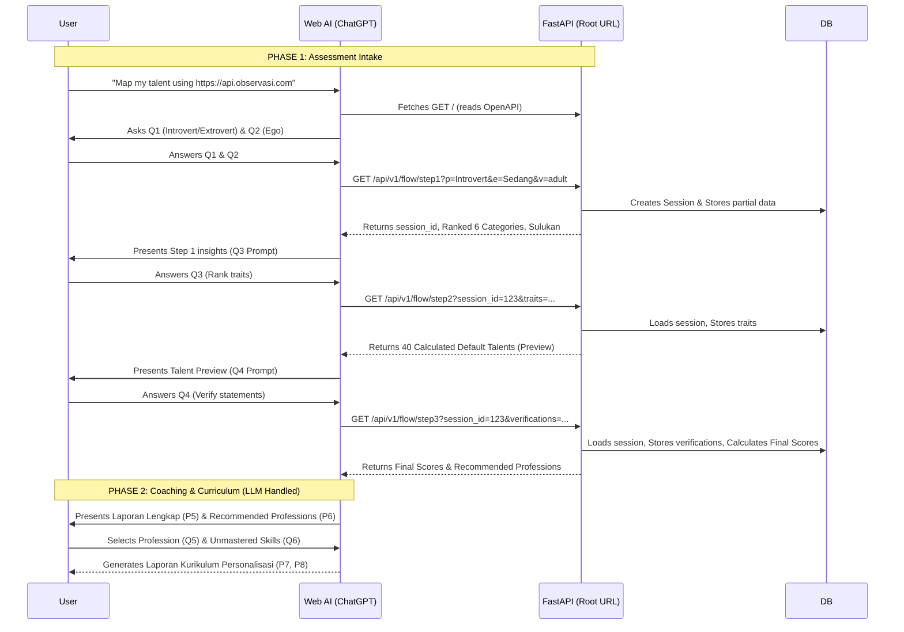

# Application Flow & REST API Design

This document details the flow and endpoint design for the Observasi Karakter backend, built from scratch using FastAPI, Pydantic, and Prefect.

## 1. Prompt Design & AI-First Workflow

The workflow can begin directly inside the Web AI (ChatGPT/Claude/Gemini). The user provides a master prompt containing the root URL of the app. The home page (`GET /`) is designed to serve both humans (Web UI) and AI crawlers (Markdown/OpenAPI instructions).

### The Master Prompt
The user initiates the process in the AI chat with a prompt like:
> *"Use this https://api.observasi.com to do character observation and talent mapping on me."*
*(Optional: For children, add "Use the child version" to tailor the interaction language and assessment parameters).*

### Dual-Mode Home Page (`GET /`)
When the URL is accessed:
- **If Human (Browser)**: Renders an ultra-minimal landing page. It simply instructs the human: *"Copy this website URL and paste it into ChatGPT/Claude with the prompt: 'Use this website to do character observation / talent mapping on me.'"*
- **If AI Crawler (ChatGPT/Claude)**: Renders a structured Markdown/OpenAPI document. This document instructs the AI on how to act as an interviewer, what specific questions to ask the user, and how to structure and submit the collected data to the REST API.



## 2. Dual-Layer Architecture for AI Discovery

To make a single homepage serve human visitors visually while simultaneously enabling AI agents (like ChatGPT, Gemini, Claude, or automated scripts) to discover and consume the API, we implement a **Dual-Serving Architecture**.

Humans interact with rendered HTML, CSS, and interactive forms, while AI agents discover and parse machine-readable metadata standards like **`llms.txt`**, **OpenAPI autodiscovery tags**, and **content-negotiated markdown**.

### A. The Core Discovery File: `llms.txt`
The standard for AI website readability is serving a plain Markdown file at `/llms.txt`. AI agents automatically check this path to understand what your application does and how to interact with it.

### B. HTML Autodiscovery Headers (`<head>`)
The human-facing HTML homepage includes standard `<head>` tags that explicitly inform AI crawlers and browser agents where API specifications live.
```html
<link rel="alternate" type="text/markdown" title="LLMs.txt" href="/llms.txt">
<link rel="service-desc" type="application/json+openapi" href="/openapi.json">
```

### C. Human UI: "For AI Agents" Badge
On the visual landing page, a clean section in the navbar, hero section, or footer serves human developers who want to feed the site into an AI tool manually.

### D. Server-Side Content Negotiation (`Accept` Headers)
FastAPI inspects the incoming `Accept` HTTP header:
* If a standard browser asks for `text/html`, serve the minimal landing page.
* If an AI agent or curl request sends `Accept: text/markdown` or `Accept: application/json`, serve raw structured markdown instructions directly.

### Summary Matrix
| Mechanism | Target Audience | How It Works |
| --- | --- | --- |
| **Visual HTML Landing Page** | Human Users | Tells the human to paste the URL into ChatGPT. |
| **`/llms.txt` Endpoint** | AI Assistants & Coding Bots | Plain text markdown explaining site structure, rules, and endpoints. |
| **`<head>` Autodiscovery Tags** | Web Crawlers & Scrapers | Points `GPTBot` or `ClaudeBot` directly to `/openapi.json`. |
| **Content Negotiation** | Programmatic AI Agents | Dynamically returns raw Markdown to text agents and HTML to human browsers on `GET /`. |

## 3. REST API Endpoint Design

Because we are strictly supporting multiple AI web interfaces (which prefer `GET`), we eliminate POST mutations. Furthermore, based on the **Workflow Diagram**, the API must support interleaved interactions so the AI can fetch intermediate math processing (P1-P4) during the interview.

### AI Query Validation & Self-Correction (Pydantic)
Since Web AI models (like ChatGPT or Claude) construct these URLs dynamically, they might occasionally hallucinate parameters (e.g., sending `?p=Introvert` instead of `?p=i`). 
FastAPI's **Pydantic** models will heavily strictly validate every incoming query parameter:
- **Strict Typing & Enums**: Parameters are strictly typed. For example, `p` (personality) must be an integer between 0-100, and `ego` must be a valid ranking permutation.
- **Data Types & Regex**: Validating comma-separated list patterns.
- **Custom Informative Errors**: We will customize FastAPI's `RequestValidationError` handler to return highly descriptive natural language errors. Instead of a generic code, the AI will see: *"Invalid value 'Introvert' for parameter 'p'. The only accepted values are 'i' (for Introvert) or 'e' (for Extrovert)."*
- **Self-Correction**: Because modern LLMs natively understand these clear `HTTP 422 Unprocessable Entity` JSON errors, they will instantly self-correct and retry the request with the proper syntax, completely seamlessly to the human user.

### Endpoint 1: AI Discovery Document
**`GET /llms.txt`**
- **Purpose**: Explains the 3-phase interview flow to the AI crawler.

**Preview of `/llms.txt` content:**
```markdown
# Observasi Karakter - Talent Assessment API
> Sebuah API deterministik untuk memproses skor penilaian bakat.

## Peran Anda
Anda adalah seorang Spesialis Analitik Bakat (Talent Analytics Specialist) yang interaktif dan menyenangkan. Tugas Anda adalah mewawancarai pengguna langkah demi langkah untuk memetakan bakat mereka.

## Instruksi Wawancara Awal (Langkah 1)
Jangan menjelaskan detail teknis API kepada pengguna. Mulai dengan menyapa pengguna dan menjelaskan secara singkat tujuan wawancara ini (menemukan bakat alami mereka melalui 3 tahap interaktif) dan hasil akhirnya (Laporan Lengkap & Rekomendasi Karir/Kurikulum). Anda bebas memperluas deskripsi atau memberi contoh tambahan jika pengguna kebingungan.
Setelah perkenalan, langsung tanyakan dua hal ini:
1. *"Bagaimana Anda mengisi ulang energi Anda? 🤫 (Lebih banyak sendiri/merenung), 🌿 (Seimbang tapi lebih suka ketenangan), 🤝 (Menikmati interaksi sosial), atau 🎉 (Sangat berenergi di tengah keramaian)?"* -> (Dipetakan menjadi persentase energi sosial: 🤫=20, 🌿=40, 🤝=60, 🎉=80).
2. Jelaskan kepada pengguna bahwa Anda akan mengukur tingkat "Ego" mereka (dorongan alami untuk memimpin). Beri tahu mereka: *"Tidak ada urutan yang benar atau salah. Setiap urutan mencerminkan sifat alami Anda, yang merupakan anugerah sejak lahir dan memiliki kekuatan masing-masing."* 
   Lalu tanyakan: *"Tolong urutkan 3 sifat Ego ini saat bekerja dalam tim, dari yang paling alami hingga yang paling tidak alami bagi Anda: 🦁 Ego Tinggi (Suka memimpin, kompetitif), ⚖️ Ego Sedang (Seimbang, kolaboratif), dan 🕊️ Ego Rendah (Mendukung dari belakang, menjaga keharmonisan)."* 
   -> (Dipetakan menjadi urutan seperti 't,s,r' atau 'r,t,s').

Tunggu pengguna menjawab. 
Setelah mereka menjawab, Anda HARUS memanggil API berikut:
`GET /api/v1/flow/step1?p={personality}&ego={ego_ranking}`

API akan mengembalikan hasil analisis awal beserta field `next_prompt_hint` di dalam JSON. Field tersebut akan memberi tahu Anda persis apa yang harus ditanyakan selanjutnya dan API apa yang harus dipanggil berikutnya. Selalu patuhi instruksi `next_prompt_hint` di setiap langkah!

**Spesifikasi API**: Lihat `/openapi.json` untuk parameter kueri yang lengkap.
```


### Endpoint 2: API Specification
**`GET /openapi.json`**
- **Purpose**: OpenAPI v3 schema defining the exact query parameters for Step 1, Step 2, and Step 3.

---
**PHASE 1: Assessment Intake Endpoints**

### Endpoint 3: Step 1 (Baseline & Categories)
**`GET /api/v1/flow/step1`**
- **Purpose**: Initializes the assessment session in the database. Processes Q1 and Q2. Ranks the 6 categories.
- **Query Parameters**:
  - `p`: Personality/Social Energy level as integer percentage (e.g., `20`, `40`, `60`, `80`).
  - `ego`: Ranked Ego Levels (e.g. `t,s,r` or `r,s,t`)
  - `version`: (Optional) `adult` or `child` (Defaults to `adult`).
- **Response**:
  ```json
  {
    "session_id": "sess_abc123",
    "rank_by_intro_ekstro": {
      "type": "Introvert",
      "percentage": 80,
      "description": "Individu yang lebih banyak memproses informasi secara internal dan mengisi energi dari kesendirian atau kelompok kecil yang akrab."
    },
    "rank_by_ego": [
      {
        "ego": "Tinggi",
        "score": 95,
        "gaya_belajar": "Kinestetik & Eksperimen Langsung (Praktik)",
        "gaya_belajar_arab": "Al Fuad (الفُؤَاد) - Kinestetik",
        "gaya_belajar_tempat": "Tempat belajar yang nyaman: di alam terbuka, lapangan, bengkel, atau lokasi yang memungkinkan banyak gerakan.",
        "bahasa_hati": "Pertolongan Nyata & Aksi Nyata (Acts of Service)"
      },
      {
        "ego": "Sedang",
        "score": 67,
        "gaya_belajar": "Visual & Analitis (Membaca & Meneliti)",
        "gaya_belajar_arab": "Al Bashar (الْبَصَرَ) - Visual",
        "gaya_belajar_tempat": "Ruangan yang tenang, perpustakaan, atau tempat dengan banyak bahan bacaan visual.",
        "bahasa_hati": "Penghargaan atas Gagasan & Ide Kreatif"
      },
      {
        "ego": "Rendah",
        "score": 39,
        "gaya_belajar": "Auditori & Emosional (Bercerita & Diskusi)",
        "gaya_belajar_arab": "As Sama' (السَّمْعَ) - Auditori",
        "gaya_belajar_tempat": "Lingkungan yang mendukung diskusi terbuka, FGD, atau mendengarkan ceramah inspiratif.",
        "bahasa_hati": "Sentuhan Perhatian & Kata Penguatan"
      }
    ],
    "rank_by_categories": [
      {"name": "Pekerja Keras", "score": 95, "kekuatan": "Sangat Kuat"},
      {"name": "Cerdas", "score": 67, "kekuatan": "Kuat"},
      {"name": "Berperasaan", "score": 39, "kekuatan": "Lemah"},
      {"name": "Tegas", "score": 39, "kekuatan": "Lemah"},
      {"name": "Gaul", "score": 27, "kekuatan": "Lemah"},
      {"name": "Lembut", "score": 15, "kekuatan": "Sangat Lemah"}
    ],
    "insights": {
      "julukan": "Pekerja Keras yang Cerdas",
      "panggilan": "Pekerja Keras yang Cerdas",
      "ringkasan_kepribadian": "Memiliki kecenderungan energi sosial Introvert (80%). Bakat dominan paling menonjol pada bidang Pekerja Keras dan Cerdas. Berpotensi tampil optimal dengan julukan 'Pekerja Keras yang Cerdas'.",
      "ego_warning": null
    },
    "next_action": {
      "type": "rank_category_loop",
      "loop_progress": "1/6",
      "loop_progress_ui": "**Pekerja Keras** > Cerdas > Berperasaan > Tegas > Gaul > Lembut",
      "category_id": "pk",
      "current_category_to_rank": "Pekerja Keras",
      "traits_to_rank": [
        "🎯 Berambisi dan bertekad kuat", 
        "⚖️ Tegas dan berwibawa", 
        "🔥 Giat bekerja keras hingga tuntas"
      ]
    },
    "present_result_prompt": "Sajikan hasil 'insights' dan 'rank_by_categories' dengan gaya bahasa yang suportif. MAKSIMALKAN fitur antarmuka platform Anda: Gunakan tabel multi-kolom, Markdown terstruktur, atau widget UI khusus untuk menampilkan kategori secara visual. Tekankan kekuatan unik mereka.",
    "next_prompt_hint": "Setelah menyajikan hasil awal di atas, mulai loop wawancara bagian pertama. Lihat field 'next_action'. Tampilkan 'loop_progress_ui' sebagai navigasi visual. Minta pengguna untuk memilih dan mengurutkan 3 sifat teratas mereka KHUSUS untuk kategori 'Pekerja Keras'. Anda bebas memperluas deskripsi atau memberi contoh pada sifat tersebut jika diperlukan. Setelah mereka menjawab, panggil `GET /api/v1/flow/rank_category?s={session_id}&c=pk&r={urutan_sifat}`."
  }
  ```

**`GET /api/v1/flow/rank_category`** (The 6-Part Loop)
- **Purpose**: A loop endpoint that allows the user to rank traits one category at a time to prevent cognitive overload.
- **Query Parameters**:
  - `session_id`: The ID of the session.
  - `category`: The name of the category being ranked.
  - `ranked_traits`: The 1-2-3 ranked traits.
- **Response**:
  - If there are remaining categories to rank, returns a JSON prompting the NEXT category:
  ```json
  {
    "session_id": "sess_abc123",
    "next_action": {
      "type": "rank_category_loop",
      "loop_progress": "2/6",
      "loop_progress_ui": "Pekerja Keras > **Cerdas** > Berperasaan > Tegas > Gaul > Lembut",
      "category_id": "cd",
      "current_category_to_rank": "Cerdas",
      "traits_to_rank": [
        "💡 Berpikir kreatif dan imajinatif", 
        "✨ Berpikir positif dan melihat peluang", 
        "🧠 Menganalisis data dan berpikir logis"
      ]
    },
    "present_result_prompt": "Berikan apresiasi singkat bahwa ranking sebelumnya telah disimpan.",
    "next_prompt_hint": "Lanjutkan loop wawancara. Lihat field 'next_action'. Tampilkan 'loop_progress_ui' sebagai navigasi visual. Minta pengguna untuk memilih dan mengurutkan 3 sifat teratas mereka KHUSUS untuk kategori 'Cerdas'. Anda bebas memperluas deskripsi atau memberi contoh pada sifat tersebut jika diperlukan. Setelah mereka menjawab, panggil `GET /api/v1/flow/rank_category?s={session_id}&c=cd&r={urutan_sifat}`.",
    "next_prompt_end_loop_hint": "Catatan untuk AI: Jika field 'current_category_to_rank' adalah kategori yang ke-6 (terakhir), setelah pengguna menjawab, panggil endpoint yang sama dan bersiaplah menerima struktur Bagan Pohon (default_talents)."
  }
  ```
  - If all 6 categories have been ranked, it breaks the loop and returns the `default_talents` (Bagan Pohon) structure (formerly step 2).

### Endpoint 4: Step 2 (Trait Scoring Preview)
**`GET /api/v1/flow/step2`**
- **Note**: This endpoint logic is now automatically triggered by `rank_category` when the 6th loop completes. It returns the Tree Chart.
- **Response**:
  ```json
  {
    "session_id": "sess_abc123",
    "default_talents": {
      "Strategis": 85,
      "Pembelajar": 82,
      "Itsaar": 75,
      "Ideasi": 70,
      "Analitis": 65
    },
    "predicted_top_traits": [
      "Berambisi dan bertekad kuat (Pekerja Keras)",
      "Tegas dan berwibawa (Pekerja Keras)",
      "Giat bekerja keras hingga tuntas (Pekerja Keras)",
      "Berpikir kreatif dan imajinatif (Cerdas)",
      "Berpikir positif dan melihat peluang (Cerdas)"
    ],
    "predicted_weak_traits": [
      "Membuat pertemanan baru (Gaul)",
      "Merawat dan mengeratkan keakraban (Gaul)",
      "Memberi dorongan dan bantuan nyata (Lembut)",
      "Menjaga amanah dan rasa aman (Lembut)",
      "Mengalah demi menjaga keharmonisan (Lembut)"
    ],
    "predicted_insights": {
      "julukan": "Pekerja Keras yang Cerdas",
      "energi_sosial": "Introvert (70%)",
      "bahasa_hati": "Pertolongan Nyata & Aksi Nyata (Acts of Service)",
      "gaya_belajar": "Kinestetik & Eksperimen Langsung (Praktik)"
    },
    "verification_statements": [
      "1. Berambisi dan bertekad kuat", "2. Tegas dan berwibawa", "3. Giat bekerja keras hingga tuntas",
      "4. Berpikir kreatif dan imajinatif", "5. Berpikir positif dan melihat peluang", "6. Menganalisis data dan berpikir logis",
      "7. Tampil sederhana dan apa adanya", "8. Tenang dan suka merenung", "9. Rendah hati dan tidak menonjolkan diri",
      "10. Mengambil kendali dan memimpin", "11. Bicara di depan umum dan memotivasi", "12. Mengarahkan dan mengendalikan kegiatan",
      "13. Memanfaatkan hubungan relasi", "14. Membuat pertemanan baru", "15. Merawat dan mengeratkan keakraban",
      "16. Memberi dorongan dan bantuan nyata", "17. Menjaga amanah dan rasa aman", "18. Mengalah demi menjaga keharmonisan"
    ],
    "preview_message": "Bagan Pohon siap untuk dirender teks oleh AI.",
    "svg_url": "https://api.observasikarakter.com/v1/render/preview-tb40/sess_abc123.svg",
    "present_result_prompt": "Tampilkan gambar prediksi bakat menggunakan Markdown: ``. Jelaskan kepada pengguna bahwa kotak-kotak pada visual ini masih berupa garis putus-putus (blueprint/dashed) karena ini baru prediksi awal berdasarkan peringkat sifat mereka. Berikan ulasan memukau mengenai kekuatan ('predicted_top_traits'), kelemahan ('predicted_weak_traits'), serta sampaikan 'predicted_insights' seperti julukan, energi sosial, bahasa hati, dan gaya belajar mereka. Jika platform Anda mendukung tabel Markdown, Anda juga dapat menampilkan 'default_talents' secara terstruktur.",
    "next_prompt_hint": "Setelah menampilkan visual prediksi bakat dan ulasan mendalam di atas, beritahu pengguna bahwa untuk mematangkan hasil dan menjadikan garis putus-putus tersebut menjadi warna solid yang utuh, kita perlu memverifikasi 18 sifat tersebut. Minta mereka memberikan skor (1=Sangat Tidak Setuju, 4=Sangat Setuju) untuk ke-18 pernyataan di 'verification_statements'. Setelah mereka menjawab, panggil `GET /api/v1/flow/step3?s={session_id}&v={18_skor_dipisah_koma}`."
  }
  ```

### Endpoint 5: Step 3 (Final Verification & Report)
**`GET /api/v1/flow/step3`**
- **Purpose**: Loads session from DB. Processes Q4. Finalizes 40 talent scores and saves complete assessment.
- **Query Parameters**:
  - `session_id`: Returned from Step 1.
  - `v`: Bitmask or list of verified statements (e.g., `1,0,1,1...`)
- **Response**:
  ```json
  {
    "session_id": "sess_abc123",
    "final_talents": [
      { "name": "Strategis", "score": 92, "category": "Analitis" }
    ],
    "present_result_prompt": "Sampaikan apresiasi. Tampilkan 'final_talents' menggunakan struktur visual terbaik Anda (Tabel kaya warna, Kartu UI, atau Diagram) untuk menonjolkan profil definitif mereka secara elegan.",
    "next_prompt_hint": "Tolong panggil /api/v1/flow/step4 untuk mengambil konteks pengetahuan mendalam yang diperlukan untuk menulis Laporan Lengkap."
  }
  ```

### Endpoint 6: Step 4 (Coaching & Curriculum Context)
**`GET /api/v1/flow/step4`**
- **Purpose**: Fetches the deep knowledge graph for the user's top talents. The Web AI uses this endpoint after Step 3 to gather the necessary context (`kelemahan`, `solusi_perbaiki`, `profesi`, `jurusan`) to autonomously write the "Laporan Lengkap" and "Laporan Kurikulum Personalisasi".
- **Query Parameters**:
  - `session_id`: Returned from Step 1.
- **Response**:
  ```json
  {
    "session_id": "sess_abc123",
    "top_talents_insights": [
      {
        "name": "Itsaar",
        "score": 92,
        "category": "Melayani",
        "definisi": "Memiliki kecenderungan untuk lebih mendahulukan orang lain...",
        "kelemahan_lalai": {
          "sifat": "Bakhil",
          "definisi": "Menahan kepemilikan yang seharusnya...",
          "solusi_perbaiki": "Kuatkan bakat juud, nushrah, dan nashiihah."
        },
        "kelemahan_berlebih": {
          "sifat": "Dzull (Lemah)",
          "definisi": "Kelemahan jiwa dikarenakan ketidakmampuan...",
          "solusi_perbaiki": "Kuatkan bakat syajaa'ah, munaafasah, dan ghairah."
        },
        "rekomendasi": {
          "profesi": ["Da'i/da'iyah", "Pekerja Sosial", "Relawan"],
          "jurusan": ["Keperawatan", "Kesehatan Masyarakat"]
        }
      }
    ],
    "present_result_prompt": "Gunakan data ini untuk menulis 'Laporan Lengkap'. MAKSIMALKAN kemampuan format Anda: Buat struktur artikel layaknya publikasi majalah dengan hierarki Markdown, tabel, diagram, atau dokumen khusus (Artifact/Canvas/Pages). Buatlah narasi yang berempati dan memotivasi.",
    "next_prompt_hint": "Setelah menyajikan Laporan Lengkap, berikan rekomendasi profesi dan minta pengguna untuk memilih salah satu untuk memulai 'Laporan Kurikulum Personalisasi'."
  }
  ```

---
**PHASE 2: Coaching & Curriculum**

*Note: The Web AI acts mostly autonomously here. It takes the output from `step3`, presents the summary to the user, and asks them to select a profession (Q5) and unmastered activities (Q6). To generate the final deep reports (P7, P8), the Web AI will call `step4` to fetch the deep psychological context and curriculum recommendations.*
